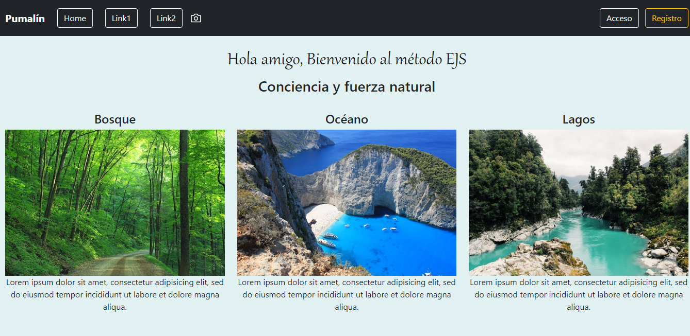
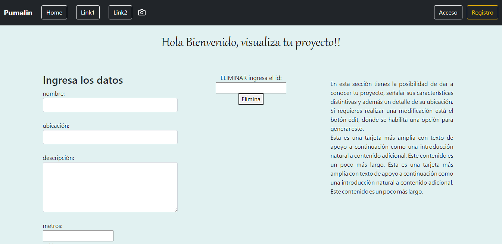

#  Aplicación Web con uso de EJS, MySQL Xampp
Esta es una aplicación básica para presentar cualquier contenido en la web utilizando el método EJS, bootstrap 5, Nodejs, MySQL, etc.<br>
Esta aplicación:
- Permite incluir contenido en tres enlaces de acuerdo a un requerimiento personal
- El último enlace permite crear/leer/actualizar/eliminar un proyecto 
## Captura de pantalla

***

## Instalación
Esta aplicación necesita lo siguiente 
> Debe tener Mysql Xampp instalado localmente<br>
> Ingresar base datos vivienda_nueva.sql
```sh
npm i
npm run dev # run in development mode
localhost:3000/contacto  
```
## Contenido
Esta aplicación fue creada con fines educativos, pues tras haber culminado un intenso período de capacitación, el objetivo es demostrar a través de un ejemplo práctico los contenidos que fueron tratados durante esta cursada. En síntesis tengo la certeza que este trabajo se ajusta de manera perfecta a las condiciones exigidas.-
## Aspectos abordados
- Uso de NODE y método Ejs
- Modelo Vista Controlador MVC
- Uso de Base de Datos (Mysql Xampp).-
- Implementación de un CRUD funcional básico.-
- Web que sea resposive.-  
